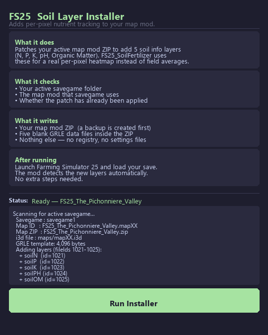

<div align="center">

# FS25 Soil Layer Installer

**One-click tool that unlocks the full soil map in FS25_SoilFertilizer**

[](https://github.com/TheCodingDad-TisonK/FS25_SoilFertilizer)
[]()
[](https://creativecommons.org/licenses/by-nc-nd/4.0/)

</div>

---

## What this does

By default, [FS25_SoilFertilizer](https://github.com/TheCodingDad-TisonK/FS25_SoilFertilizer) tracks one average nutrient value per field. Spray the left half of a field with nitrogen and the whole field shows the same number — because the game doesn't have individual pixel layers for soil nutrients until you add them.

This tool patches your active map mod to add five density-map layers:

| Layer | Tracks |
|---|---|
| `soilN` | Nitrogen |
| `soilP` | Phosphorus |
| `soilK` | Potassium |
| `soilPH` | pH |
| `soilOM` | Organic Matter |

Once the patch is applied, the soil overlay map shows real per-pixel values — spray half a field and you'll see a visible left/right split on the map.

---

## Screenshot



---

## Quick Start

> **Close Farming Simulator 25 before running.**

1. Download `FS25_SoilLayerInstaller.exe` from the [Releases](../../releases/latest) page
2. Double-click it
3. Click **Run Installer**
4. Launch FS25 and load your save — done

The installer finds your savegame and map automatically. No folder browsing required.

---

## Requirements

- Farming Simulator 25 installed
- [FS25_SoilFertilizer](https://github.com/TheCodingDad-TisonK/FS25_SoilFertilizer) **v2.2.6.0 or later**
- At least one career save using the map you want to patch
- The map mod ZIP installed in your Mods folder
- FS25 **closed** when you run the installer

---

## How it works

1. Reads your active savegame to identify which map mod you're using
2. Creates a backup of the map mod ZIP before touching anything
3. Patches the map's `.i3d` file inside the ZIP — adds five `<File>` and `<InfoLayer>` entries
4. Copies a blank GRLE file (all zeros) as the starting data for each new layer
5. Repacks the ZIP and verifies all five layers are present

On next game load, the engine registers the new layers automatically. FS25_SoilFertilizer detects them and switches from field-average mode to per-pixel mode.

---

## Supported Maps

Any FS25 map mod that:
- Ships as a single ZIP in the Mods folder
- Has its main `.i3d` file at `maps/mapXX.i3d` inside the ZIP
- Stores terrain data at `maps/data/` inside the ZIP

**Tested on:** The Pichonniere Valley (`FS25_The_Pichonniere_Valley`)

Most standard FS25 maps follow this structure. Custom maps that deviate significantly may not be detected — open an issue if yours doesn't work.

---

## Backup & Restore

A backup is created automatically before any changes:

```
YourMap.zip.backup_soilinstaller
```

**To undo the patch:**
1. Close FS25
2. Delete `YourMap.zip`
3. Rename `YourMap.zip.backup_soilinstaller` → `YourMap.zip`
4. Launch FS25 — soil layers are gone, everything else unchanged

---

## Already Patched?

Re-running the installer on a patched map shows **Already Patched ✓** and does nothing. Safe to run at any time.

To force a re-patch: restore the backup first, then run the installer again.

---

## Troubleshooting

**"No savegame found"**
Make sure you have at least one career save in:
`Documents\My Games\FarmingSimulator2025\savegame1`

**"Map ZIP not found"**
The map mod must be installed as a ZIP in your Mods folder. Confirm the map mod is present and try again.

**Soil map not showing after load**
Wait a few seconds after loading your save — the overlay rebuilds on a short cycle. If values still don't appear, check `log.txt` for `[SoilFertilizer]` lines confirming the layers were detected.

**"Partial success" result**
One or more layers may not have been inserted. Restore the backup, open a [GitHub issue](../../issues/new) with the installer log output, and do not load FS25 until confirmed.

---

## Command-Line / Python Usage

If you prefer the terminal, the Python script is included:

```bash
python SoilLayerInstaller.py
```

Requires **Python 3.8 or later**. Same logic as the GUI, output in the console. No additional dependencies.

---

## License

[CC BY-NC-ND 4.0](https://creativecommons.org/licenses/by-nc-nd/4.0/) — free for personal use, no modifications, no commercial use.
